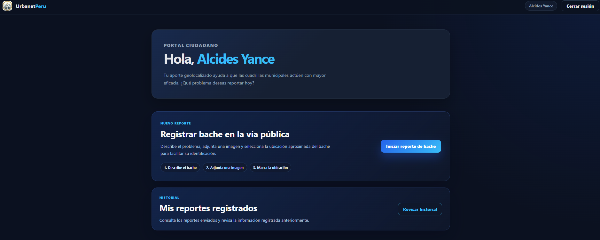
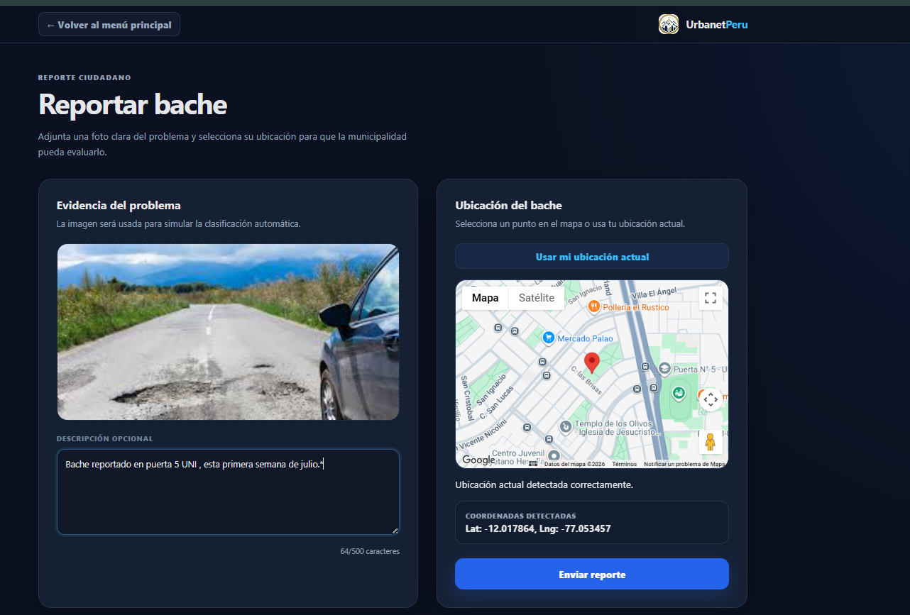
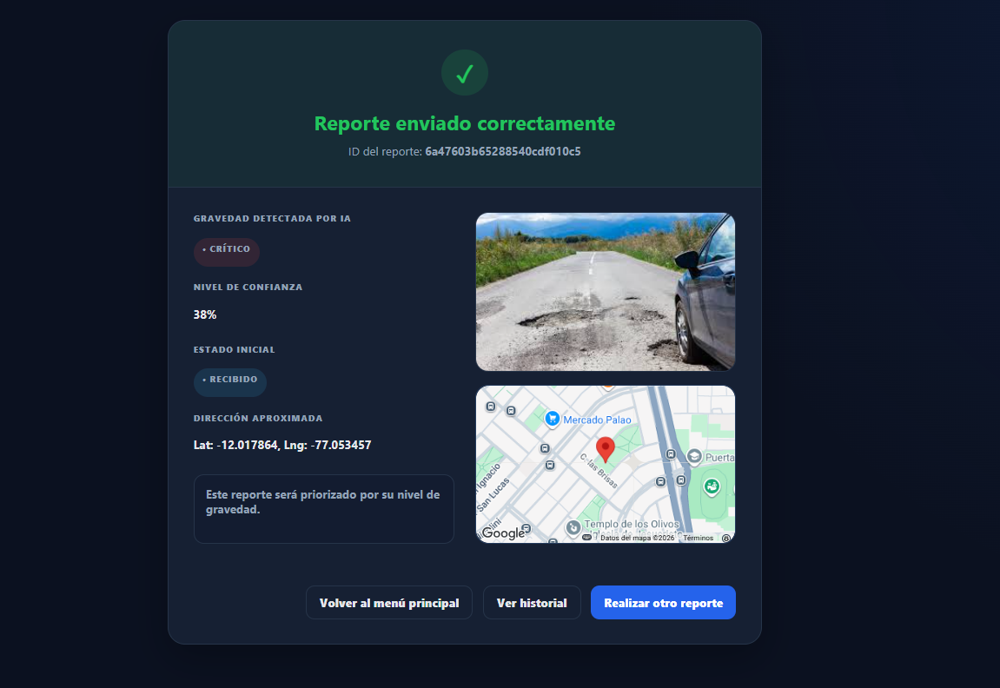
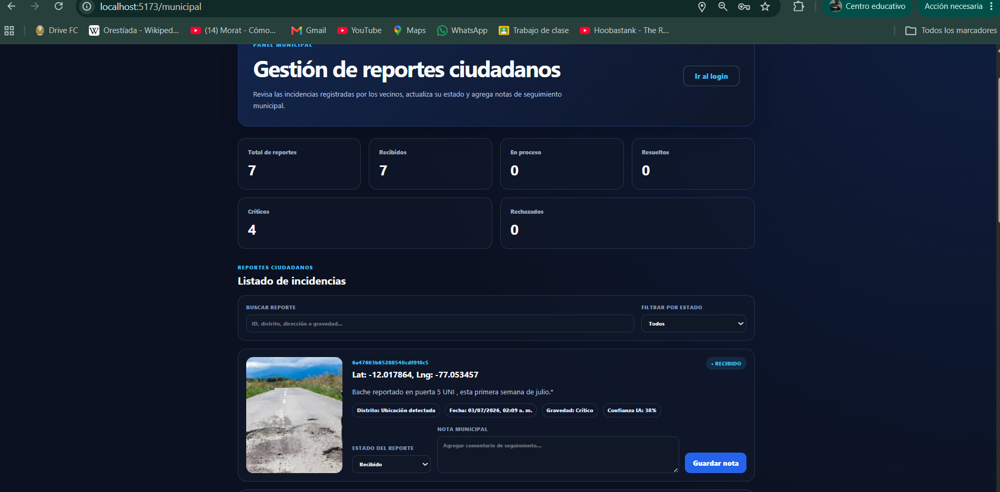

# Caso de prueba de integración de la IA

1. Primero debemos realizar el logging del ciudadano.

    

2. En la ventana principal realizamos un reporte y añadimos el contenido.

    

    

3. Luego de enviar el reporte , la IA realizara un calculo de la gravedad detectada del bache (leve-moderado-crítico).

    

4. Finalmente , el municipal podrá verificarlo en su ventana.

    

